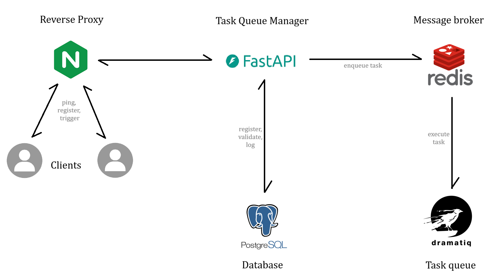
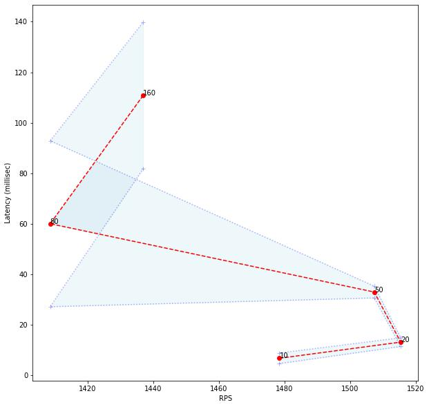

# Task Queue Manager

Built a scalable backend with NGINX, FastAPI, PostgreSQL, redis, dramatiq. Containerized with Docker.

## Metrics:
- Under light load (best case): >= 1500 RPS at < 7 msec latency
- The RPS is maintained even as the load increases from 10 to 160 concurrent-connections.

###Diagram:
- x, y axes: RPS, Latency (msec)\
- The integer written beside each dot is the number of concurrent-connections.\

### API Testing
- The load was generated with the tool [wrk](https://github.com/wg/wrk) on the slowest endpoint 'trigger'.
- The metrics were calculated in on a dev setup: WSL, 8 logical-cores, processor: i5-113G7
  - For these measurements, the backend was run in WSL directly, rather than as docker-containers.
